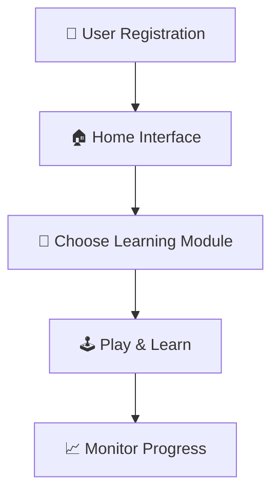

# 🎓 EduSphere – From Learning to Independence 🌈  
**Domain:** Open Innovation  
**Built With ❤️ for Children with Down Syndrome**  

EduSphere is more than just an app — it's a **mission wrapped in colors, voices, and care**.  
Designed to empower children with **Down syndrome**, it transforms mundane daily tasks into **joyful learning adventures**.  

> In a world racing ahead with AI and tech, EduSphere ensures **no child is left behind**.

---

## 🚨 The Problem  

Traditional education methods?  
* ❌ Boring  
* ❌ One-size-fits-all  
* ❌ Not built for children with cognitive challenges  

Children with **Down syndrome** often face hurdles in:  
* Recognizing **dates, emergency numbers, and prices**  
* Understanding **traffic signals, rules, and safety cues**  
* Identifying **MRP and expiry dates** while shopping  
* Using **phones and computers** confidently  
* Navigating **social interactions and cultural norms**  

---

## 💡 Our Solution – EduSphere  

EduSphere turns life skills into an **interactive playground**.  
We mix **tech, empathy, and design thinking** to build a platform that’s:  

* ✨ Voice-guided  
* ✨ Visually soothing  
* ✨ Touch-optimized  
* ✨ Fun and gamified  

> 💡 **Core Philosophy**: Education must include everyone — especially those who learn differently.

---

## 🌟 Features & Modules  

| 🎮 **Feature**                     | 💬 **Description** |
|----------------------------------|--------------------|
| 🗓️ *DOB & Emergency Learning*     | Learn birthday, year, and emergency numbers through games |
| 🛒 *MRP & Expiry Finder*          | Simulated shopping for spotting expiry dates and prices |
| 🚦 *Traffic & Safety Lessons*     | Animated signals and car games for traffic awareness |
| 📱 *Mobile & Computer Simulators* | Touch-based lessons on calling, texting, and desktop use |
| 💬 *Greetings & Festivals*        | Social interaction and Indian festival modules |
| 🎭 *Mood Tracker*                 | Emoji-based mood tracking to express feelings |
| 🔡 *Read Letters & Numbers*       | Learn language basics through animations |

---

## 🛠 Tech Stack  

* **Frontend:** React Native (Expo), Tailwind CSS / NativeWind  
* **Database:** MongoDB (User Data)  
* **Accessibility Tools:** React Native TTS, Native Speech APIs  
* **Animations:** Lottie, Glowing UIs  
* **Device Compatibility:** Mobile-first (smartphones & tablets)  

---

## 🧪 Research-Driven Design  

🧒 Tested at **Jeevodaya School, Sadar** with real users.  
👀 Observations:  
* ✅ Kids navigated the app independently  
* ✅ Visual & voice-based support boosted understanding  
* ✅ Festival games improved social inclusion  
* ✅ Mood tracker helped emotional expression  
* ✅ Traffic activities taught real-world safety  
* ✅ MRP task increased shopping awareness  

---

## 🔃 App Flow  


Modules are adaptive — difficulty adjusts based on the learner’s pace.

---

## 📥 Installation & Setup
```
### 1. Clone the Repository  
```bash
git clone https://github.com/khushalibegde/HackOrbit_khushalibegde18.git
cd HackOrbit_khushalibegde18
```
### Install dependencies
```bash
Copy
Edit
npm install
```
### Start development server
```bash
Copy
Edit
npx expo start
```
### Launch the app
Use Expo Go app to scan the QR code
Or run on your emulator (Android/iOS)

---

### 🧭 Future Roadmap
🌍 Add multilingual support

💰 Introduce money recognition module

🧼 Add hygiene & self-care routines

⏰ Include time management training

🎯 Use AI for personalized simulations

#### 👩‍🏫 Special thanks to the educators & children of Jeevodaya School for their feedback, joy, and trust.

---

### 📚 References
Disha Abhiyan Workbooks – Jai Vakeel Foundation
Surveys with parents and educators
Real-world user testing and feedback loops

---

### ✨ Final Thought
"Education is not about who finishes first —
it’s about making sure everyone crosses the line."

---

EduSphere is here to redefine learning —
one emoji tap, one glowing signal, one proud smile at a time. 💗
